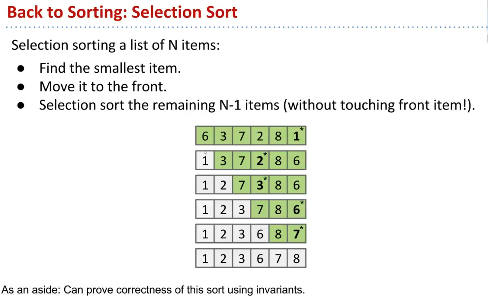

- 
- void selection_sort( int [] arr){
	- for (int i =0; i< arr.length()-1; i++){
		- int min = i;
		- for (int j =i +1; j < arr.length(); j++){
			- if(arr[i] > arr[j])
				- min =j
		- }
		- int temp = arr[i];
		- arr[i] = arr[min];
		- arr[min] = temp;
		-
	- }
- }