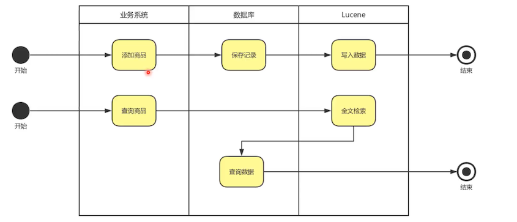

- ## 创建全文索引
- 给 sku 表的 title 字段添加全文索引
-
- ```
  create fulltext index text_title
    on t_sku (title);
  ```
- ```
  - ```
  - ```
  Copied!
  ```
- 查询
-
- ```
  select id, title, images, price
  from t_sku
  where match(title) against('小米9');
  ```
- ```
- ```
- ```
- ```
-
- ## 建 Lucene 索引
- 