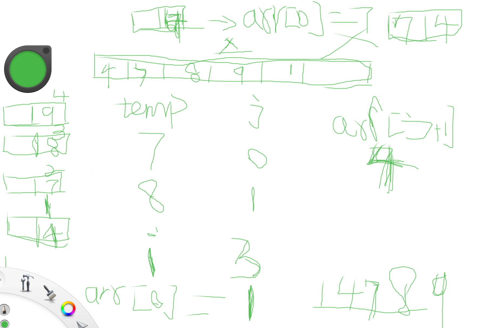

-
- insertion sort = after comparing elements to the left
	- shift elements to the right to make room  to insert a value.
	- only temp is bigger than the left,  then  to insert into the room(right next room of the left elements).
- void insert_sort(int [ ] arr){
	- for (int i =i ; i< arr.length(); i++){
		- int temp = arr[i];
		- int j= i -1;
		- while(j >= 0 && arr[j] > temp){
			- arr[j+1] = arr[j];
			- j--;
		- }
	- arr[j+1] =temp;    // mapped to the sec point above.
	- }
- }
-
	- for (int i =1; i < arr.length(); i++)
	- {
		- int temp = arr[i];
		- int j = i-1;
		- while( j >=0 && arr[j] > temp){
			- arr[j+1] = arr[j];
			- j--;
		- }
		- arr[j +1] = temp;
		- }
	-
	- 
	-
	-
	-
	- }
-