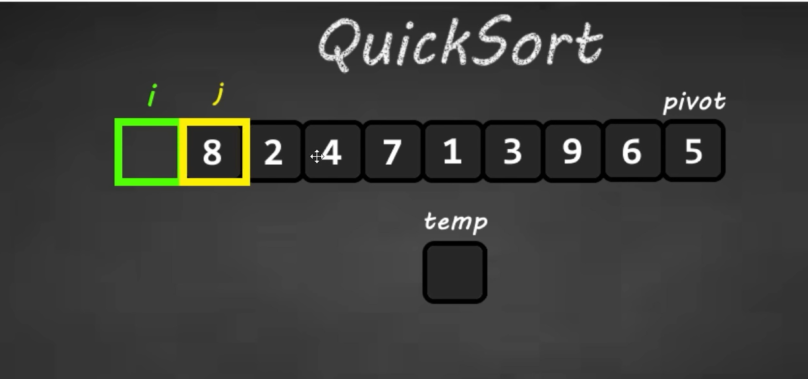

- recursively divide into 2 parts;
- public class Main{
	- int [] arr = [8, 2, 3, 4, 5 , 1, 6,7];
	- mergeSort(arr);
	- for( int i = 0; i < arr.length; i++){
	- }
- }
-
- private static void mergeSort( int [ ] arr){
	- int lengh = arr.length;
	- if( length <= 1)   return; /// base case;
	- int mid = length /2;
	-
	- int [ ] leftArr = new int [mid];
	- int [ ] rightArr= new int [length - mid];
	- int i  =0; //left array
	- int j = 0;
	- for(; i < length;  i++){
		- if(i < mid){
			- leftArr[i] = arr[i];
			-
		- }
		- else {
			- rightArr[j] = arr[j];
			- j++;
		- }
	- }
	- mergeSort(leftArr);   // divede into many 2 different , then to assign to temp set.
	- mergeSort(rightArr);
	- merge( lef Arr, rightArr, array);
	-
- }
-
- private static void merge (int[] rightArr, int [ ] leftArr, int arr[]  ){
	- int  r= 0, l =0, j =0;
	- int leftsize = arr.length /2;
	- int rightSize = arr.length - leftSize;
	-
	- // check the condition for merging.
	- while (l < arr.leftSize && r < arr.rightSize){
		- while(leftArr[l]  <  rightArr[r]){
			- arr[i] = leftAr[i];
			- i++;
			- l++;
		- }
		- else {
			- arr[i] =  rightArr[l];
			- i++;r++;
			-
		- }
	- while(  l < leftSize){
		- arr[i] = leftArr[l];
		- i++; l++;
	- }
	- while (r< rightSize){
		- arr[i] = rightarr[r];
		- r++;
		- i++;
	- }
	- }
- }
-
- 