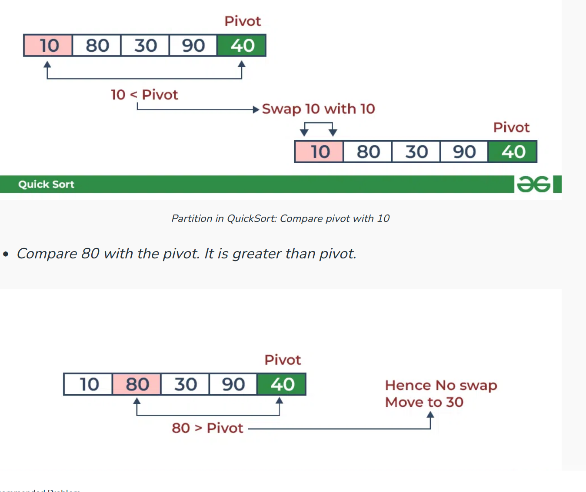

- 
-
- void quick_sort(int [] arr, int low, int high){
	- if( low < high){
		- int partition = partition(arr, low, high);
		- quick_sort(arr, low , partition -1);
		- quick_sort(arr, partition +1, high);
	- }
- }
- void partition(int [] arr, int low , int high){
	- int pivot = arr[high];
	- int i = low -1;
	- for( int j= low; j <= high -1; j++){
		- if(arr[j] < pivot){
			- // increment index of smaller elements,
			- i++;
			- swap(arr, i, j);
		- }
	- }
	- //  change the position of pivot,  at same time be the partition point
	- swap(arr, i+1, j);
	- return  i+1;  // position of pivot
	- }
- }