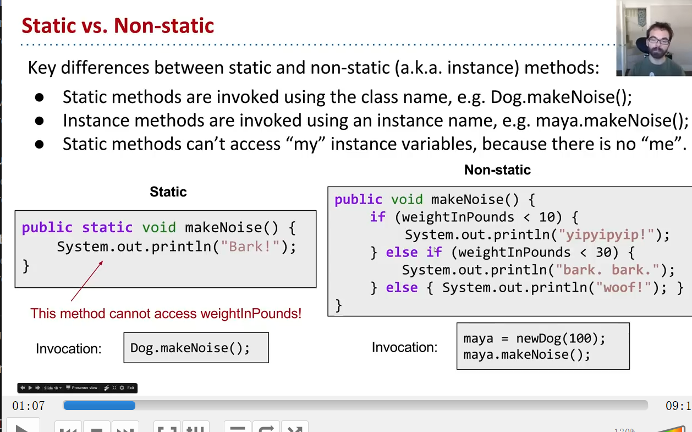

- static function cant be invoked by the instance , only by the classname .
- static func can't access variable of instance.
-
- Generally, use non static function.
- 
-
- why static method, some classes are never instantiated. for example, Math
- x= Math.round(5.6);   better than   Math  b = new Math(); x =b.round(x);