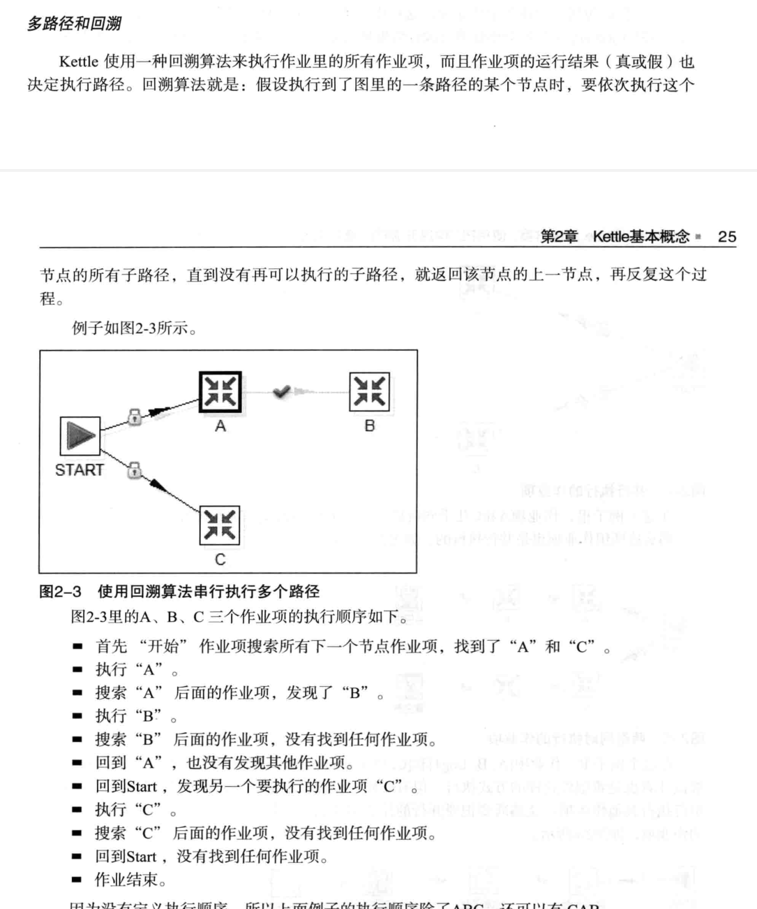

- OLTP(  Online transaction Processing )在线事务处理系统
- OLTP 和bi  （data warehouse 简称DWH）， OLTP系统中，许多并发的用户请求通常只处理一条数据或有限的一组数据，而数据仓库系统必须有处理几百万条数据的能力，来响应用户的一个简单 请求。
-
- ETL:
	- 1 简单定义： 从OLTP系统中转移到数据库的一列列操作的集合
	- 2  分三个部分：
		- 抽取： 一般需要连接到不同的数据源， 以便为随后的步骤提供数据。
		- 转换： 在抽取和加载之间的，任何对数据的处理过程都是转换，这些处理过程通常包括但不限于;
			- 1 移动数据
			- 2 根据规则验证数据
			- 3 数据和数据结构修改
			- 4集成多个数据源的数据
			- 5 根据处理后的数据，计算派生值或者聚集值
			- 5 加载： 加载到目标系统的一切操作。
-
- 数据仓库和数据集市：数据仓库，涵盖各种业务数据，不能被终端用户直接访问
  collapsed:: true
	- 而数据集市是以特定的数据分析为目的，例如零售和客户来电。
-
- 某种机制控制JOb， 实际转换的细节工作被称为transformation.
  collapsed:: true
	- 转换（transformation 由几个步骤组成，步骤之间的连接由HOP 跳来决定的。）
-
- 数据规模：
	- 并发： etl能同时处理多个数据流
	- 分区： 能够使用特定的分区模式，分发到多个并发的数据流中去。
	- 集群： etl 的过程能分配到多个机器上完成。
	- 复用性： kettle里有一个映射（子转换）步骤，可以完成转换的复用。转换还以到其它的作用中使用，同样作业也可以成为某个作业的子作业。
	- 不同etl工具对转换的定义也不同。
	- kettle 提供了标准化的构建组件来实现etl开发人员的不断的重复的需求。避免了自定义的开发。
	- 只映射需要的字段：在字段变动的时候，大量的映射会增加维护成本
	- kettle 流程中所有未指定的字段都自动传递到下一个组件中，减少了维护成本，也就是说输入的字段会出现在输出中。
- Job-> transformation-> one or more steps ( steps connected by hop  namely line between two steps.)
- step:  输出跳(outgoing hop)，输入跳（incomming hop），
	- 输出跳可以轮流发送和复制发送， 复制发送是将所有的数据发给多个输出跳。
	- 跳在转换里不能循环：因为转换里的每一个步骤都依赖于上一个步骤获取字段值。
	- 跳由一个独立的线程运行。
		- 转换的起点 eg: '表输入'步骤（因为这个步骤生成数据行），终点就是'文本文件输出' 步骤（这个步骤将数据写到文件）后续没有节点。
		- 转换里的步骤，几乎是几同启动的，所以不算顺序执行，当然想要顺序执行可以用到作业(job)
		-
- 设计转换时：数据类型规则，多个步骤向一个步骤中写数据时，多个步骤输出的数据行应该有相同的数据结构，即字段相同，字段数据类型相同，字段顺序相同。
-
- 作业（Job）:作业项， 作业项可以有影子拷备，各个拷备有着同样的信息，步骤的名字是不一样的。 绝大部分情况下，作业都是顺序性 串行的，非非并行的。
- 作业跳： 作业项之间的线，
	- 无条件执行，：无论当前的作业项是否成功都会执行下一个作业项，
	- 当作业项执行为真时：作业跳上会显示绿色的钩，
	- 当作业项执行为假时：作业跳上会显示红色的停止图标。
- 
-